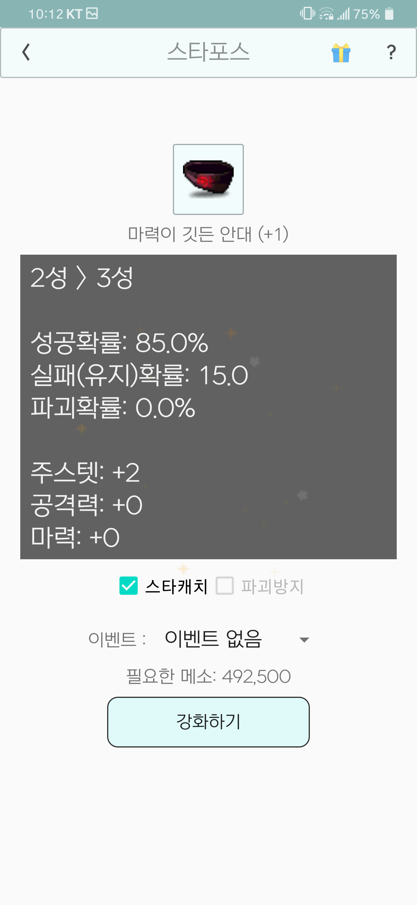
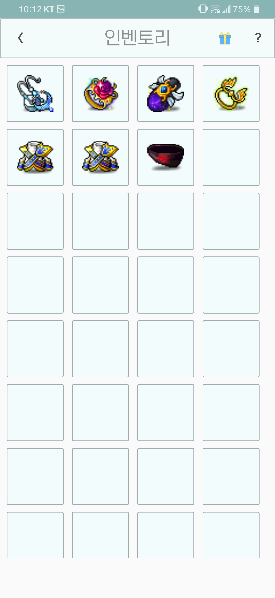
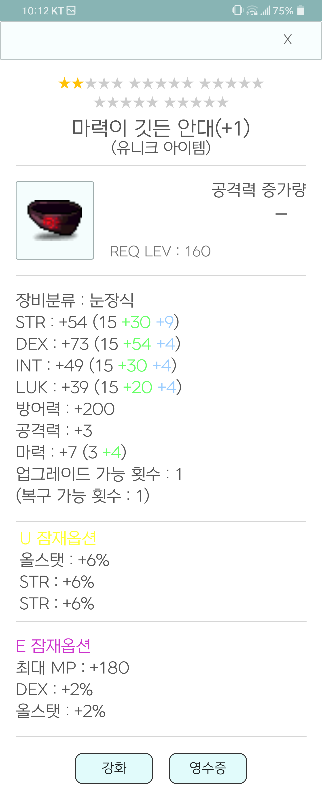
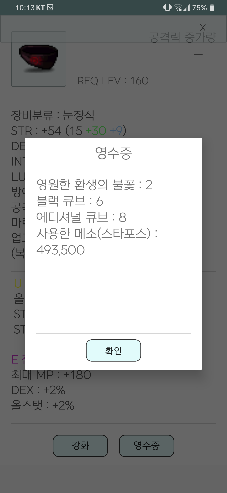

# MapleSimulation
메이플스토리 강화 시뮬레이션 앱입니다.

메인화면 입니다. 상단의 장비추가를 누르면 장비 검색창으로 이동합니다.  
강화를 원하는 장비를 추가해주면 우측 그림과 같이 장비가 추가됩니다.

주문서, 추가옵션, 잠재능력 설정 가능합니다.

스타포스도 가능합니다.

인벤토리에선 현재까지 강화한 장비들을 볼 수 있습니다. 길게 누르면 아이템이 삭제됩니다.

장비를 누르면 장비에 대한 상세정보를 볼 수 있습니다.

영수증을 누르면, 현재까지 사용된 아이템 내역을 볼 수 있습니다.

감사합니다.
